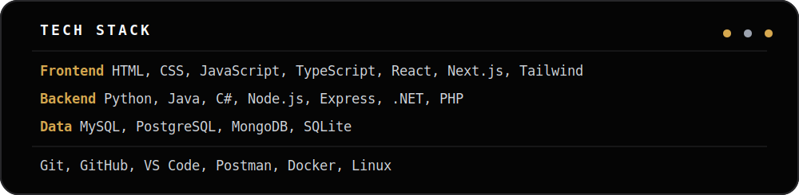

<p align="center">
  
</p>

<h2 align="center">Ana Montes | Developer Portfolio</h2>

<p align="center">
  <a href="https://github.com/user-ana">
    
  </a>
</p>

<p align="center">
  
  
  
  
</p>

---

## [ PROFILE ]

<p align="center">
  
</p>

```txt
┌──(skills@github)-[~/focus]
└─$ cat intereses.txt

Nombre       : Ana Montes
Usuario      : user-ana
Carrera      : Ingenieria en Sistemas
Ruta         : Frontend, Backend, Bases de datos y desarrollo de software
Objetivo     : Crear proyectos bonitos, funcionales y listos para CV
```

---

## [ STACK ]

<p align="center">
  
</p>

<p align="center">
  <b>Frontend</b>
</p>

<p align="center">
  
</p>

<p align="center">
  <b>Backend y lenguajes</b>
</p>

<p align="center">
  
</p>

<p align="center">
  <b>Bases de datos y herramientas</b>
</p>

<p align="center">
  
</p>

<p align="center">
  
  
  
  
  
  
  
  
</p>

<p align="center">
  <sub>Stack en aprendizaje y practica constante para proyectos academicos, portafolio y crecimiento profesional.</sub>
</p>

---

## [ FEATURED PROJECT ]

<table>
  <tr>
    <td width="58%">
      <h3>Alta Disponibilidad con IP Virtual (VIP)</h3>
      <p>
        Interfaz web academica para presentar un sistema de alta disponibilidad con IP Virtual,
        enfocada en monitoreo, redundancia, acceso administrativo y conceptos de arquitectura de computadoras.
      </p>
      <p>
        <b>Tecnologias:</b> HTML, CSS, JavaScript
      </p>
      <p>
        <a href="https://github.com/user-ana/alta-disponibilidad-vip">
          
        </a>
        <a href="https://user-ana.github.io/alta-disponibilidad-vip/">
          
        </a>
      </p>
    </td>
    <td width="42%">
      <a href="https://user-ana.github.io/alta-disponibilidad-vip/">
        
      </a>
    </td>
  </tr>
</table>

---

## [ PROJECT PREVIEW ]

<p align="center">
  <a href="https://github.com/user-ana/alta-disponibilidad-vip">
    
  </a>
</p>

<p align="center">
  <a href="https://user-ana.github.io/alta-disponibilidad-vip/">
    
  </a>
</p>

<table>
  <tr>
    <td>
      <b>Proyecto Web</b><br />
      Interfaces modernas con HTML, CSS, JavaScript y frameworks frontend.
    </td>
    <td>
      <b>Proyecto Backend</b><br />
      APIs, logica de servidor, autenticacion y conexion con bases de datos.
    </td>
    <td>
      <b>Proyecto de Datos</b><br />
      Modelado, consultas SQL, reportes y organizacion de informacion.
    </td>
  </tr>
</table>

---

## [ GITHUB STATS ]

<p align="center">
  
  
</p>

<p align="center">
  
</p>

---

## [ CV MODE ]

```txt
Ana Montes
Estudiante de Ingenieria en Sistemas.

Interesada en desarrollo frontend, backend, bases de datos y construccion
de proyectos tecnologicos funcionales, visualmente cuidados y bien documentados.

Busco fortalecer mi portafolio profesional con proyectos academicos y personales
que demuestren logica, diseno, organizacion y aprendizaje continuo.
```

---

## [ CONTACT ]

<p align="center">
  <a href="mailto:bcoin5992@gmail.com">
    
  </a>
  <a href="https://github.com/user-ana">
    
  </a>
  <a href="https://www.instagram.com/cyrk_anag">
    
  </a>
</p>

<p align="center">
  
</p>
